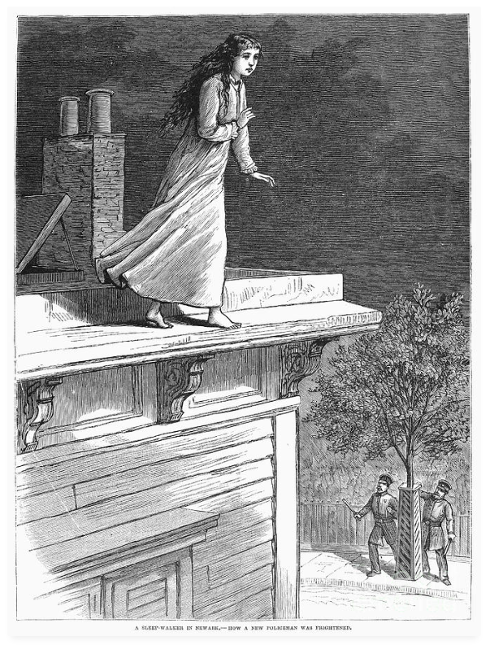

---
---

<link rel="stylesheet" href="styles.css" type="text/css">

## Broader Impacts: Designing and Communicating for Consequential Science
 

***Asking a creative scientist to be effectively concerned by the consequences of his work would be the equivalent of waking the sleepwalker, making him aware that the world is far from obeying his categories. He would doubt and fall, that is, be lost for science.*** - Elisabeth Stengers, *Another Science is Possible*

This course is designed to give undergraduate and graduate student scientists from multiple disciplines the opportunity to think critically and systematically about their science and their day-to-day scientific practice in broader social and ethical contexts. Drawing on real world case studies and readings from the History and Philosophy of Science (HPS) and Science and Technology Studies (STS), students will be challenged to think, talk and write about *what counts* as *good* science, and *who counts* as a scientist. Participants will examine common criteria and frameworks by which scientific researchers and their research are evaluated (e.g., NSF Merit Review Criteria), and will develop a more sophisticated understanding of notions of *broader impacts, intellectual merit, equity, diversity, inclusion, engagement, education* and *mentorship.* They will design and carry out an independent inquiry into an ethical issue of science in society, ultimately producing a short research-based commentary-style article suitable for a journal or media outlet with a broad audience. They will also design and present a proposal for a broader impacts activity, and they will develop components of their professional portfolio. Students will come away with a clearer sense of who they can be as a scientist, and a plan for how they can use and change thier science for better futures.

### [2020 Syllabus](./files/GEO 371T Broader Impacts Syllabus_Spring 2020-REVISION TO ONLINE-27Mar2020-v5_rmReading.pdf)
