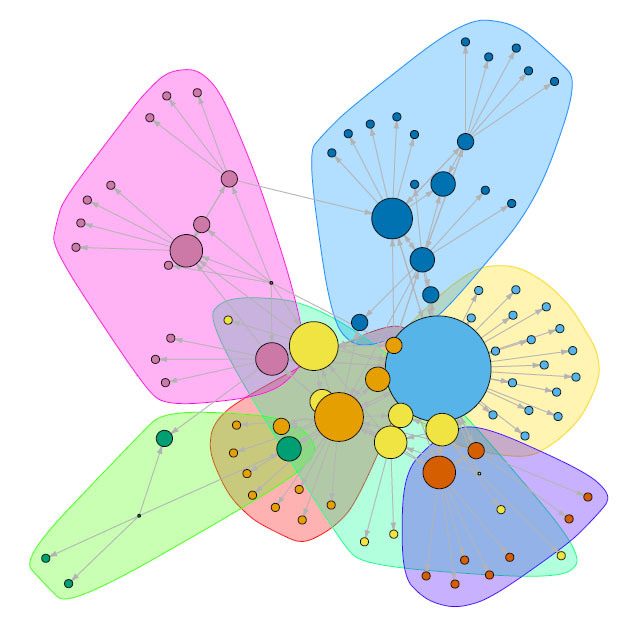

---
---

<link rel="stylesheet" href="styles.css" type="text/css">

## Learning in Open and Participatory Media Ecologies

Contemproary participatory media enables the fluid formation and disruption of such learnign contexts and networks, presenting a challenge to traditional notions of learning as a highly disciplined, community-bound activity. I have developed multimodal narrative case study approaches to study cases of networked particiaptory learning, including ed-tech innovators, student scientists undertaking course-based research, citizen scientists, and networks of teaching artists. My goal is to understand what "21st century skills" of "conencted" and "lifelong" leanring look like in the digitcal whild in order that we may draw lessons for the development of open learning and innovation networks that can more reliably pursue difficult democratic goals of equity and justice. 

******
*******

<link rel="stylesheet" href="styles.css" type="text/css">

## Values-sensitive Technology Innovation

Technology and design processes are too often presumed to be neutral or inevitable forces, and and they tend to be engaged in ways that ultimately re-inforce the educational and social orthodoxy.  This work, grounded in studies of teacher and entrepreneurial innvoation, is focused on developing new frameworks for expanding our understanding of what counts as innovative in education, and who counts as an innovator. By more consistently surfacing the values and ethical implciations of technology engagment in educational contexts, we hope to identify and support values-sensitive critical innvoations and critical innovators that stand a better chance of "disrupting" entrenched notions of what school is, could, and should be.  

************
******

## Design Research on Global and Distance Education

I create experiences that engage learners in activities and environments that reflect the cultural and infrastructural contexts in which they aspire to act, and that show them what it means to innovate through their activity. I have designed, taught in and taught about online learning experiences and digital infrastructure for global education, development, and health, primarily in an East African context. I have evaluated and presented on these programs and projects as cases of blended instruction, digital assessment, and alternative credentialing for professional development, for instance, at ISTE and UW-Madison’s DT&L conference.

******
******
